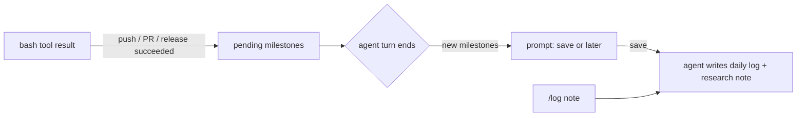

# pi-captains-log

*Captain's log, stardate today.* An engineering logbook for [pi](https://pi.dev) and [oh-my-pi](https://github.com/can1357/oh-my-pi).

Lots of good engineers keep a daily log of what they worked on, so years later they can search for "when did we change X, and why?" Most stop after a few weeks because writing it is one more chore. Your coding agent already knows what you did: the commands it ran, the PRs it opened, the numbers it measured. pi-captains-log asks at real stopping points whether to save that into your Markdown vault (Obsidian or any folder of notes), then has the agent write it.

## What it does

- **Notices stopping points.** Opening a PR (`gh pr create`), merging one (`gh pr merge`) or publishing a release (`gh release create`) is a stopping point. Successful `git push`es are collected quietly and go into the next entry; they don't prompt on their own, so fix-up pushes to an open PR stay silent. Failed or no-op commands count for nothing, including a rejected push hidden behind `| tail`.
- **Asks once, and you can shush it.** When the agent finishes a turn after a stopping point, you get one prompt: *Make it so*, *Not now*, or *Stop asking this session*. No status-bar counter; `/log` always works.
- **`/log [note]`** writes an entry at any time, with an optional note in your own words.
- **Writes notes where they belong**, following the bundled `captains-log` skill and its templates:
  - a **daily log** (`05 Daily Log/YYYY-MM-DD.md`), appended under a time heading: short bullets with repo, ticket, PR links, outcome and what's still open;
  - a **project or research note** when the work produced evidence worth keeping (measurements, decisions, exact identifiers), linked from the day's entry;
  - **meeting notes** from what you paste or dictate, and **career** wins when you ask ("add this to my brag doc").
- **Sets up your vault.** Before each entry it makes sure the layout below exists. A vault that already has `Projects/` or `2 - Research/` keeps those; only missing folders are created, and no note is moved or renamed.
- **Fits your vault.** It searches before writing, files research next to an existing project folder when there is one, appends instead of rewriting, and never writes secrets.
- **Answers questions later.** "When did we switch the importer to streaming, and why?" Ask the agent; the skill tells it to search the log and cite the note.

## Install

```bash
pi install npm:pi-captains-log   # pi
omp install pi-captains-log      # oh-my-pi
```

To try it from a checkout without installing:

```bash
pi -e ./pi-captains-log
omp -e ./pi-captains-log
```

## Configure

| Variable | Default | Meaning |
|---|---|---|
| `PI_CAPTAINS_LOG_VAULT` | (required) | Absolute path to your notes vault; `~/` is expanded |
| `PI_CAPTAINS_LOG_<ROLE>_DIR` | see layout | Pin a role's folder (`INBOX`, `DAILY`, `PROJECTS`, `RESEARCH`, `MEETINGS`, `CAREER`, `ARCHIVE`), e.g. `PI_CAPTAINS_LOG_DAILY_DIR="Journal"` |
| `PI_CAPTAINS_LOG_GIT` | `commit` | `off`, `commit` (commit changed notes) or `push` (commit and push) |

## Layout

```text
pi-captains-log/
├── extensions/captains-log/index.ts   stopping-point detection, prompt, /log
├── src/                               milestone rules, vault layout, request builder
├── skills/captains-log/
│   ├── SKILL.md                       what goes where; how to write and search the log
│   └── templates/                     daily-log.md, research-note.md, meeting-note.md
└── test/
```

```text
your-vault/
├── 00 Inbox/        anything that doesn't fit elsewhere yet
├── 05 Daily Log/    2026-10-07.md
├── 10 Projects/     widgets/2026-10-07 importer benchmark.md
├── 20 Research/     findings not tied to one project
├── 30 Meetings/     2026-10-07 importer kickoff.md
├── 40 Career/       2026 accomplishments.md (only on request)
└── 90 Archive/      finished projects (moved only on request)
```

Each role first looks for a folder you already have: the number prefix and case are ignored, and `Daily Notes` or `Journal` count as the daily log. The numbers only apply to folders it has to create, and they keep the layout in reading order in Obsidian's sidebar.

## How it works



The extension only decides *when* to ask and hands the agent a precise request: vault, file, heading, milestones, your note and the git policy. The `captains-log` skill decides *how* to write. Keeping the trigger in code makes it reliable; a skill alone tends to forget to offer mid-session.

## Develop

Requires Node 22.18 or later (TypeScript runs natively, no build step).

```bash
npm install
npm run check   # tsc
npm test        # node --test
```

## License

MIT. A fan's nod to a certain starship; not affiliated with or endorsed by the owners of Star Trek.
