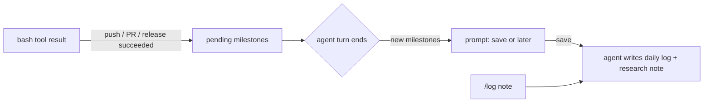

# pi-logbook

An engineering logbook for [pi](https://pi.dev) and [oh-my-pi](https://github.com/can1357/oh-my-pi).

Lots of good engineers keep a daily log of what they worked on, so years later they can search for "when did we change X, and why?" Most stop after a few weeks because writing it is one more chore. Your coding agent already knows what you did: the commands it ran, the PRs it opened, the numbers it measured. pi-logbook asks at real stopping points whether to save that into your Markdown vault (Obsidian or any folder of notes), then has the agent write it.

## What it does

- **Notices stopping points.** A successful `git push`, `gh pr create`, `gh pr merge` or `gh release create` counts as a milestone. Failed commands don't, including a rejected push hidden behind `| tail`.
- **Asks once.** When the agent finishes its turn, you get one prompt listing the new milestones: save now or later. It doesn't ask again for the same milestone.
- **`/log [note]`** writes an entry at any time, with an optional note in your own words.
- **Writes two kinds of notes**, following the bundled `logbook` skill:
  - a **daily log** (`Daily Log/YYYY-MM-DD.md`), appended under a time heading: short bullets with repo, ticket, PR links, outcome and what's still open;
  - a **research note** when the work produced evidence worth keeping (measurements, decisions, exact identifiers), linked from the day's entry.
- **Fits your vault.** It searches before writing, uses your existing folders and link style, appends instead of rewriting, and never writes secrets.
- **Answers questions later.** "When did I bump the Textract tier?" Ask the agent; the skill tells it to search the logbook and cite the note.

## Install

```bash
pi install npm:pi-logbook   # pi
omp install pi-logbook      # oh-my-pi
```

To try it from a checkout without installing:

```bash
pi -e ./pi-logbook
omp -e ./pi-logbook
```

## Configure

| Variable | Default | Meaning |
|---|---|---|
| `PI_LOGBOOK_VAULT` | (required) | Absolute path to your notes vault; `~/` is expanded |
| `PI_LOGBOOK_DAILY_DIR` | `Daily Log` | Folder for daily logs, inside the vault |
| `PI_LOGBOOK_GIT` | `commit` | `off`, `commit` (commit changed notes) or `push` (commit and push) |

## How it works



The extension only decides *when* to ask and hands the agent a precise request: vault, file, heading, milestones, your note and the git policy. The `logbook` skill decides *how* to write. Keeping the trigger in code makes it reliable; a skill alone tends to forget to offer mid-session.

## Develop

Requires Node 22.18 or later (TypeScript runs natively, no build step).

```bash
npm install
npm run check   # tsc
npm test        # node --test
```

## License

MIT
